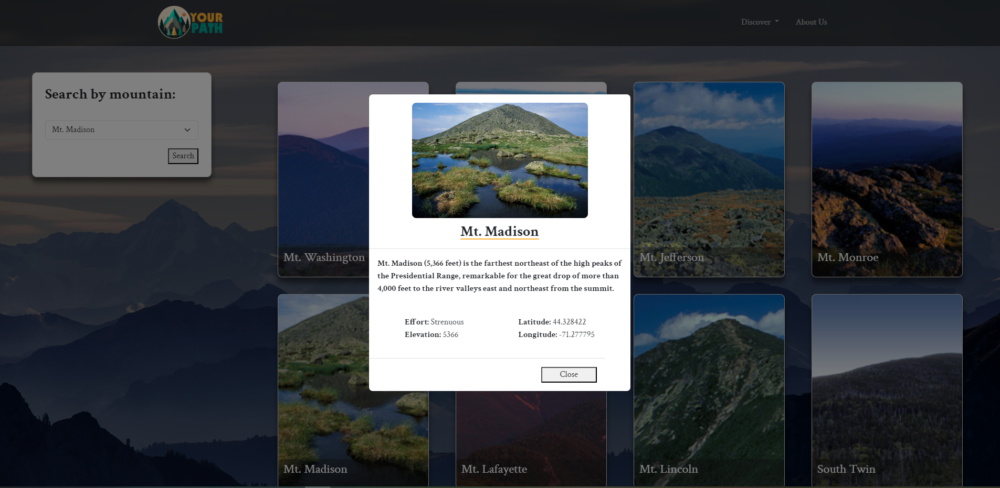
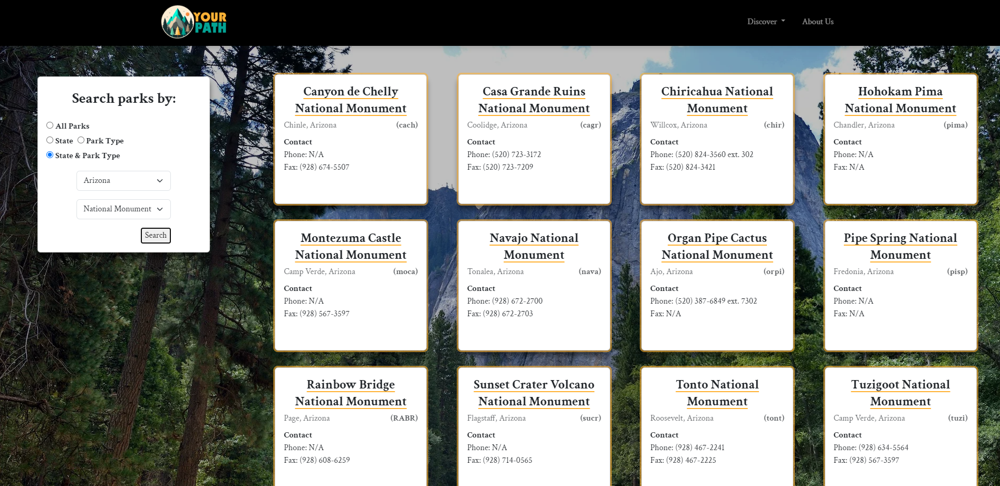
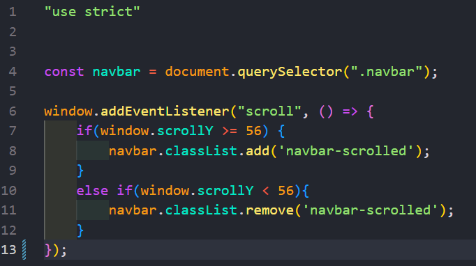

# Your Path Website

This website will allow users to search for parks and mountains around the USA. It has a simple userface that lets the user select a park type or state to display coresponding parks. Both the park and mountain pages display all information cards by default before the user can select their preferences and have the correct mountain or parks to display. 

### Prerequisites

Knowledge of HTML / CSS / Bootstrap

* [HTML](https://developer.mozilla.org/en-US/docs/Web/HTML)
* [CSS](https://developer.mozilla.org/en-US/docs/Web/CSS)
* [Javascript](https://developer.mozilla.org/en-US/docs/Web/JavaScript)

## HTML
**index.HTML**

**mountains.HTML**

**parks.HTML**

## Code Highlight
The navbar's background color changes based on where the user is on the page. By adding an event listener, a class can be added to the navbar in order to gain or remove css properties.

**Code**

## Authors

 **Justine Elbuhel** 

- https://github.com/JustineElbuhel
- https://www.linkedin.com/in/justine-elbuhel-/

## Acknowledgments

* Bootstrap v5.3
* W3Schools
* YearUp Peers
